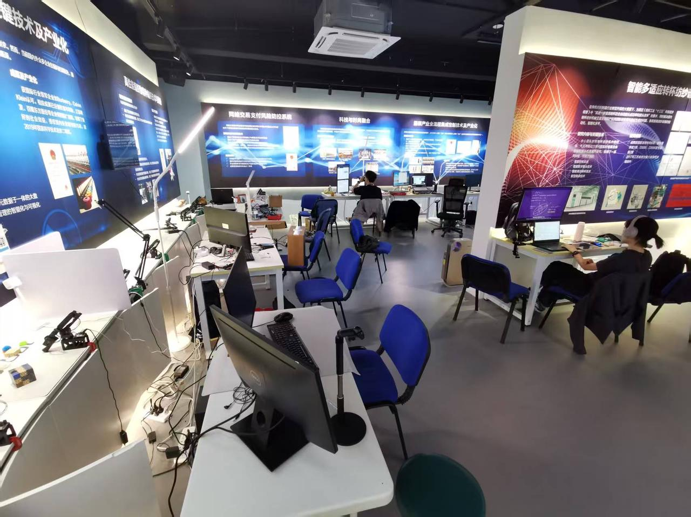

欢迎来到 Mbot具身智能实验室！

- Mbot实验室依托东华大学信息与智能科学学院，于2025年1月成立，实验室位于东华大学2号学院楼226室。
- 实验室专注于具身智能领域的基础理论、前沿技术与创新应用研究，研究方向涵盖但不限于模仿学习、视觉-语言-动作模型、视觉语言导航等，致力于推动机器智能体在感知、理解与行动的发展。
- 欢迎对具身智能感兴趣的师生加入我们！

---

Welcome to the Mbot Embodied Intelligence Laboratory!

- The Mbot Lab, affiliated with the School of Information and Intelligent Science at Donghua University, was established in January 2025 and is located in Room 226, Building 2.
- Our laboratory focuses on fundamental theories, cutting-edge technologies, and innovative applications in the field of embodied intelligence. The research areas include, but are not limited to, imitation learning, vision-language-action models, and vision-language navigation.
- We are committed to advancing the integrated development of perception, understanding, and action in intelligent agents. We warmly welcome students and researchers who are interested in embodied intelligence to join us!

---

实验室全景

实验室地点

实验室合照

---

项目(Projection)

星触机械臂

<video src="../images/网页开头.mp4" scrolling="no" border="0" frameborder="no" framespacing="0" allowfullscreen="true"></video>

Xdog带臂机器狗

XLerobot具身智能框架

---

合作企业和单位

<table frame=void rules=none align=center>
  <tr>
    <td valign="top" align="center" style="padding-top:15px;">
      
       
      Xbotics具身智能开源社区
    </td>
    <td valign="top" align="center" style="padding-top:15px;">
      
       
      睿尔曼智能(Realman)
    </td>
    <td valign="top" align="center" style="padding-top:15px;">
      
       
      上海启能青少年体育俱乐部
    </td>
    <td valign="top" align="center" style="padding-top:15px;">
      
       
      方舟无限
    </td>
  </tr>
    <tr>
    <td valign="top" align="center" style="padding-top:15px;">
      
       
      香港大学
    </td>
    <td valign="top" align="center" style="padding-top:15px;">
      
       
      浙江大学
    </td>
    <td valign="top" align="center" style="padding-top:15px;">
      
       
      复旦大学
    </td>
    <td valign="top" align="center" style="padding-top:15px;">
      
       
      上海工程技术大学
    </td>
  </tr>
    <tr>
    <td valign="top" align="center" style="padding-top:15px;">
      
       
      华勤技术
    </td>
    <td valign="top" align="center" style="padding-top:15px;">
      
       
      电信天翼数字生活
    </td>
    <td valign="top" align="center" style="padding-top:15px;">
      
       
      复旦大学
    </td>
    <td valign="top" align="center" style="padding-top:15px;">
      
       
      上海工程技术大学
    </td>
  </tr>
</table>

---

加入我们

      
      
图1. 图片标题
 

